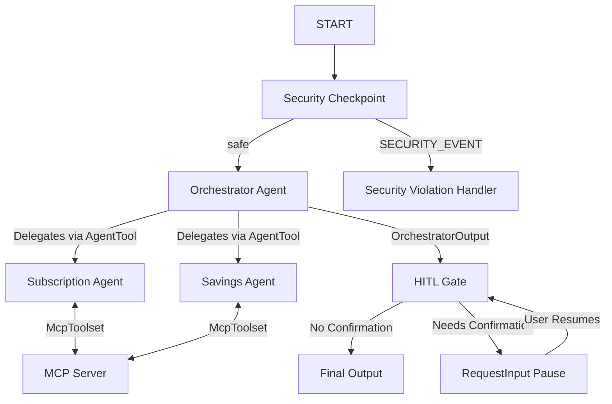

# FinFit — Personal Finance Concierge

FinFit is a secure, stateful personal finance concierge built using the Google Agent Development Kit (ADK) 2.0. It helps users manage their active subscriptions, tracks upcoming bill payments, and generates custom savings strategies while protecting personal data using an inline security checkpoint.

## Prerequisites

Before setting up FinFit, ensure you have:
* **Python 3.11+** installed.
* **uv** package manager installed.
* **Gemini API key** from [Google AI Studio](https://aistudio.google.com/apikey).

## Quick Start

1. Clone the repository:
   ```bash
   git clone <repo-url>
   cd finfit
   ```

2. Configure environment variables:
   Copy the example environment file and add your `GOOGLE_API_KEY`:
   ```bash
   cp .env.example .env
   ```

3. Install dependencies:
   ```bash
   make install
   ```

4. Launch the local playground UI:
   ```bash
   make playground
   ```
   This will open the interactive UI in your browser at [http://localhost:18081](http://localhost:18081).

## Architecture Diagram



## How to Run

* **`make playground`**: Runs the interactive web interface on `http://localhost:18081` for manual testing.
* **`make run`**: Runs the agent as a local FastAPI web server on port `8080` for backend integration.
* **`make test`**: Runs the unit tests with `pytest`.

## Sample Test Cases

### 1. Subscription Cost Listing
* **Input**: `Show me my active subscriptions and calculate the total monthly cost.`
* **Expected Flow**: `START` ➔ `security_checkpoint` (safe) ➔ `orchestrator` ➔ `subscription_agent` (calls `list_mock_subscriptions` MCP tool) ➔ `hitl_gate` (no confirmation needed) ➔ `final_output`.
* **Verification**: In the playground UI, you will see a detailed listing of Netflix, Spotify, Gym, Adobe CC, and Amazon Prime, along with their respective costs, and a total calculated monthly expenditure of ~$143.05.

### 2. Usage Check and Suggestion
* **Input**: `Analyze my subscription usage. Do I have any low-usage subscriptions I should cancel?`
* **Expected Flow**: `START` ➔ `security_checkpoint` (safe) ➔ `orchestrator` ➔ `subscription_agent` (calls `get_subscription_details` MCP tool) ➔ `hitl_gate` (no confirmation needed) ➔ `final_output`.
* **Verification**: You will see that `Gym` has a usage score of 10/100 and was last used 28 days ago, and the agent suggests cancelling it.

### 3. Cancel Subscription (HITL)
* **Input**: `Please cancel my Gym subscription.`
* **Expected Flow**: `START` ➔ `security_checkpoint` (safe) ➔ `orchestrator` (flags cancellation) ➔ `hitl_gate` (yields `RequestInput` for `confirm_cancel_subscription_gym`).
* **Verification**: The UI pauses and presents a confirmation prompt: `Confirmation Required: Do you want to proceed with cancel_subscription for 'Gym'?`.
* **Action**: Reply `Yes` to proceed. The workflow resumes, updates the local subscription state, and confirms: `Successfully cancelled subscription for 'Gym'.`

## Assets

* **Workflow Diagram**: [assets/architecture_diagram.png](file:///d:/adk-workspace/finfit/assets/architecture_diagram.png)
* **Cover Banner**: [assets/cover_page_banner.png](file:///d:/adk-workspace/finfit/assets/cover_page_banner.png)

## Demo Script

The demonstration narration guide is available at [DEMO_SCRIPT.txt](file:///d:/adk-workspace/finfit/DEMO_SCRIPT.txt).

## Troubleshooting

1. **Error `ValidationError` or `cannot import name 'Event'` at graph initialization:**
   * *Cause*: Importing Event from `google.adk.workflow` or incorrect edge tuple formats.
   * *Fix*: Ensure `Event` is imported from `google.adk.events.event` and edges with routes are defined as 2-tuples mapping to dictionaries (e.g. `(source, {route: target})`).

2. **Error `404 Model Not Found`:**
   * *Cause*: Stale Gemini API models (e.g. `gemini-1.5-flash` or `gemini-1.5-pro` are retired).
   * *Fix*: Verify `.env` has `GEMINI_MODEL=gemini-2.5-flash` or `gemini-2.5-flash-lite`.

3. **Code changes not appearing in Playground (Windows):**
   * *Cause*: File reload conflicts with event loops on Windows.
   * *Fix*: Stop the server using the command below and restart it:
     ```powershell
     Get-Process -Id (Get-NetTCPConnection -LocalPort 18081, 8090 -ErrorAction SilentlyContinue).OwningProcess | Stop-Process -Force
     make playground
     ```

## Push to GitHub

1. Create a new repo at https://github.com/new
   - Name: finfit
   - Visibility: Public or Private
   - Do NOT initialize with README (you already have one)

2. In your terminal, navigate into your project folder:
   ```bash
   cd finfit
   git init
   git add .
   git commit -m "Initial commit: finfit ADK agent"
   git branch -M main
   git remote add origin https://github.com/<your-username>/finfit.git
   git push -u origin main
   ```

3. Verify .gitignore includes:
   ```
   .env          ← your API key — must NEVER be pushed
   .venv/
   __pycache__/
   *.pyc
   .adk/
   ```

⚠ NEVER push .env to GitHub. Your API key will be exposed publicly.
