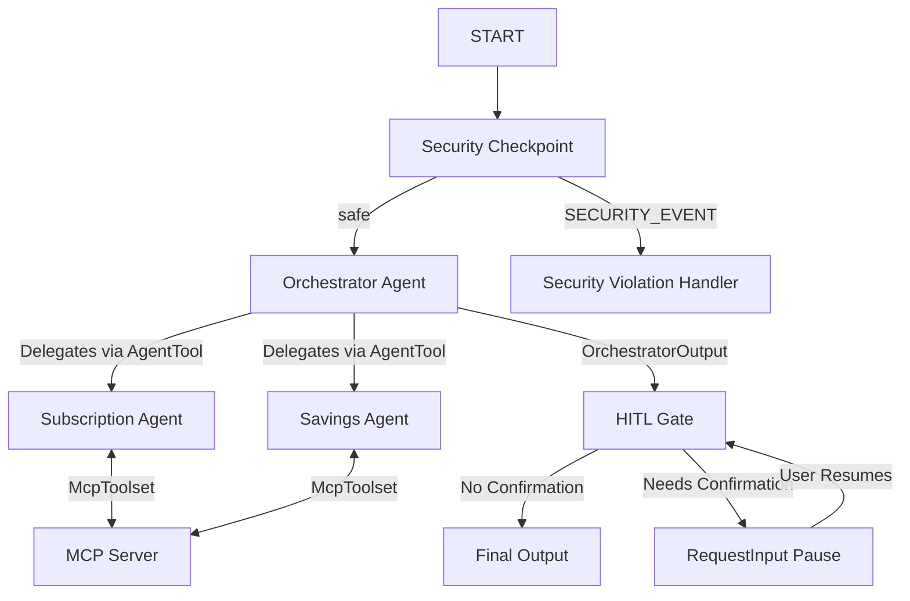

# Submission Write-Up: FinFit

## 1. Problem Statement
Many individuals struggle to keep track of their monthly and annual digital subscriptions (e.g., streaming services, gym memberships, software licenses). These "ghost expenses" slowly drain bank accounts because users forget to cancel unused trials or memberships. Additionally, users often lack tailored saving strategies that align directly with their real subscription spend. FinFit serves as an intelligent personal finance concierge that scans subscriptions, monitors upcoming bills, suggests budget allocations, and cancels unwanted services, all within a secure and user-consented boundary.

## 2. Solution Architecture

## 3. Concepts & File References

* **ADK Workflow**: Implemented as a graph-based stateful workflow (`finfit_workflow`) in [agent.py](file:///d:/adk-workspace/finfit/app/agent.py#L248-L259).
* **LlmAgent**: Used for three core LLM units: `orchestrator`, `subscription_agent`, and `savings_agent` in [agent.py](file:///d:/adk-workspace/finfit/app/agent.py#L42-L99).
* **AgentTool**: Utilized by the `orchestrator` to delegate queries to `subscription_agent` and `savings_agent` in [agent.py](file:///d:/adk-workspace/finfit/app/agent.py#L96).
* **MCP Server**: Implemented using the FastMCP framework in [mcp_server.py](file:///d:/adk-workspace/finfit/app/mcp_server.py). It exposes domain-specific tools which are wired into the sub-agents via `McpToolset` in [agent.py](file:///d:/adk-workspace/finfit/app/agent.py#L33-L40).
* **Security Checkpoint**: Implemented as the `security_checkpoint` workflow node in [agent.py](file:///d:/adk-workspace/finfit/app/agent.py#L103-L177) that enforces PII scrubbing, injection checks, and privacy boundaries.
* **Agents CLI**: Project scaffolded and managed using `agents-cli` (manifest configuration in `agents-cli-manifest.yaml`).

## 4. Security Design
FinFit integrates a multi-layered security checkpoint node:
* **PII Scrubbing**: Automatically detects and redacts credit cards and email addresses from the input query before sending it to the LLM agents.
* **Prompt Injection Defense**: Scans input for common system instruction overrides and jailbreaks, immediately blocking requests and logging the incident.
* **Privacy Boundary Consent**: Blocks users from asking about other individuals' accounts (such as a spouse's or friend's spending), protecting third-party data.
* **Structured Audit Logs**: Every scan, warning, and violation creates a structured JSON log entry stored inside the session state (`security_audit_logs`) for audit trailing.

## 5. MCP Server Design
The FastMCP server ([mcp_server.py](file:///d:/adk-workspace/finfit/app/mcp_server.py)) provides four core tools:
* **`list_mock_subscriptions`**: Returns user subscription info, giving the agents current price data.
* **`get_subscription_details`**: Fetches usage frequency metadata (usage score out of 100) and descriptions to help flag low-usage apps.
* **`generate_savings_calculator`**: Processes income and target savings rates to return recommended limits for wants and needs.
* **`estimate_upcoming_bills`**: Calculates which bills are due within a customizable window (e.g. next 30 days) to prevent surprise deductions.

## 6. Human-in-the-Loop (HITL) Flow
To prevent unauthorized actions, any operation that updates state (such as cancelling a subscription or committing to a savings plan) must pass the `hitl_gate` node ([agent.py:L186-L245](file:///d:/adk-workspace/finfit/app/agent.py#L186-L245)).
* When a cancellation is requested, the workflow pauses, yields a `RequestInput` card, and prompts the user for explicit confirmation.
* Once the user responds with "Yes", the workflow resumes, writes the updated subscription status to the session state, and confirms execution. This ensures that the agent never acts on financial data without human approval.

## 7. Demo Walkthrough
* **Test Case 1 (Subscription Cost Listing)**: User asks for a subscription list. The query is scanned, sent to `subscription_agent`, which calls `list_mock_subscriptions` to list Netflix, Spotify, Gym, Adobe CC, and Amazon Prime, and totals the monthly spend to ~$143.05.
* **Test Case 2 (Usage Check)**: User asks about unused services. The agent fetches details via `get_subscription_details`, flags `Gym` as having only a `10` usage score (unused for 28 days), and suggests cancellation.
* **Test Case 3 (Cancel Gym Subscription)**: User says "Please cancel my Gym subscription." The orchestrator triggers confirmation via `RequestInput`. The user replies "Yes", the state updates, and Gym is marked as `cancelled`.

## 8. Impact / Value Statement
FinFit empowers consumers to regain control over their digital footprint and finance. By identifying unused services, notifying users of upcoming payments, and suggesting realistic budget adjustments, FinFit saves the average user hundreds of dollars a year in unintended subscriptions. Furthermore, by keeping all intelligence and checks local (via local MCP servers and security checkpoints), it ensures premium privacy and security.
